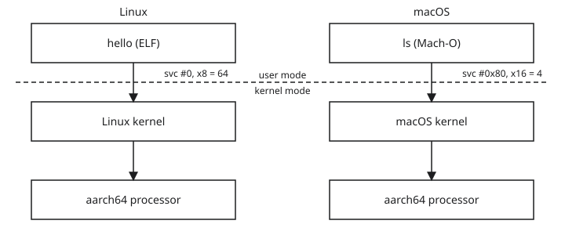

Part 1 of a series on [elfuse](https://github.com/sysprog21/elfuse), a tool
that runs Linux programs on a Mac without a Linux kernel. The series assumes
the reader can read a short program and has used a terminal, and defines other
terms where they first appear.

All elfuse code and output below come from commit
[`73d8246b`](https://github.com/sysprog21/elfuse/tree/73d8246b), built on an
Apple Silicon Mac.

## The problem

The elfuse repository contains a 30-line Linux program, `tests/hello.S`.
Build it, then run it on the Mac directly:

```sh
$ make build/test-hello
  AS      tests/hello.S
  LD      build/test-hello
$ ./build/test-hello
zsh: exec format error: ./build/test-hello
```

The macOS kernel refuses to start the file, and the shell prints the error.
The same file runs on a Linux machine with an ARM processor, and the Mac also
has an ARM processor.

Run it through elfuse instead:

```sh
$ build/elfuse build/test-hello
hello
```

## A program is a file

Ask the `file` command what the two kinds of program look like:

```sh
$ file build/test-hello
build/test-hello: ELF 64-bit LSB executable, ARM aarch64, version 1 (SYSV), statically linked, not stripped
$ file /bin/ls
/bin/ls: Mach-O universal binary with 2 architectures: [x86_64:...] [arm64e:...]
...
```

An executable is a file in a format the operating system knows how to load.
On Linux that format is ELF (Executable and Linkable Format). On macOS it is
Mach-O. The first bytes of the file say which one it is:

```sh
$ xxd build/test-hello | head -1
00000000: 7f45 4c46 0201 0100 0000 0000 0000 0000  .ELF............
$ xxd /bin/ls | head -1
00000000: cafe babe 0000 0002 0100 0007 0000 0003  ................
```

`cafebabe` marks a universal binary, a wrapper around one Mach-O file per
architecture, each of which starts with `cffaedfe`.

macOS does not recognize `7f 45 4c 46` and reports "exec format error". The
file format is the smaller problem, since any loader that follows the ELF
specification can read it. The larger problem is what the program does once it
runs.

Two more terms from that `file` output. "ARM aarch64" is the processor
architecture: the set of instructions the chip understands. Apple Silicon
chips run the same aarch64 instruction set (Apple calls it arm64), which is
why the instructions themselves are not the problem. "Statically linked"
means the file contains everything it needs and depends on no other file.
Most programs are not like that: they call into a shared library called
libc, which provides functions such as `printf`. This one does not use libc,
so it is small enough to read in full.

## The whole program

`tests/hello.S` with its header comment removed
([full file](https://github.com/sysprog21/elfuse/blob/73d8246b/tests/hello.S)):

```asm
.text
.global _start
_start:
    /* write(1, msg, 6) */
    mov x0, #1          /* fd = stdout */
    adr x1, msg         /* buf = address of message */
    mov x2, #6          /* count = 6 bytes */
    mov x8, #64         /* __NR_write = 64 */
    svc #0

    /* exit(0) */
    mov x0, #0          /* exit code = 0 */
    mov x8, #93         /* __NR_exit = 93 */
    svc #0

msg:
    .ascii "hello\n"
```

This is assembly: one line per instruction, where an instruction is the
smallest step a processor performs. `mov x0, #1` puts the number 1 into
register `x0`. A register is a storage slot inside the processor; aarch64 has
31 general ones, `x0` through `x30`. `adr x1, msg` puts the address of the
label `msg` into `x1`. An address is the position of a byte in memory, and
`msg` is where the six bytes of `hello\n` live.

The assembled program shows where everything landed:

```text
$ aarch64-elf-objdump -d build/test-hello
...
0000000000400000 <_start>:
  400000:	d2800020 	mov	x0, #0x1                   	// #1
  400004:	100000e1 	adr	x1, 400020 <msg>
  400008:	d28000c2 	mov	x2, #0x6                   	// #6
  40000c:	d2800808 	mov	x8, #0x40                  	// #64
  400010:	d4000001 	svc	#0x0
  400014:	d2800000 	mov	x0, #0x0                   	// #0
  400018:	d2800ba8 	mov	x8, #0x5d                  	// #93
  40001c:	d4000001 	svc	#0x0

0000000000400020 <msg>:
  400020:	6c6c6568 	.word	0x6c6c6568
...
```

Every instruction is four bytes, the program starts at address `0x400000`,
and `msg` sits right after the last instruction at `0x400020`. The address of
`msg` and the address of the first `svc`, `0x400010`, reappear in the syscall
log at the end.

## System calls

Six of the eight instructions only put numbers into registers. The other two
are `svc #0`. A program cannot reach a screen, a disk, or the network by
itself. The kernel controls those: it is the part of the operating system that
manages the hardware and stays in memory while the machine is on.

When a program needs something from the kernel, it makes a system call, or
syscall: it puts a request number and the arguments into agreed registers and
executes `svc` ("supervisor call"). The processor stops running the program
and jumps into the kernel. The kernel reads the registers, does the work, puts
a result into `x0`, and resumes the program at the instruction after `svc`.

On aarch64 Linux the agreement is: syscall number in `x8`, arguments in `x0` to
`x5`, result in `x0`. Number 64 is `write`. Its three arguments are a file
descriptor, the address of the bytes to write, and how many. A file descriptor
is a small integer that names something open for reading or writing; 0, 1, and 2
are standard input, output, and error, so `x0 = 1` means standard output, here
the terminal. On success `write` returns the number of bytes written, 6 here. On
failure it returns a small negative number whose magnitude is an error code, for
example -9 for `EBADF`, "bad file descriptor".

Number 93 is `exit`. It never returns, which is why nothing follows the second
`svc`.

## Two modes

Programs go through the kernel because the processor runs in one of several
modes, and the mode decides what the code is allowed to do. Programs run in
user mode, where instructions that access hardware are forbidden. The kernel
runs in kernel mode, where they are allowed. `svc` switches to kernel mode and
jumps to an address the kernel set in advance, so the program cannot choose
where it enters the kernel.

This lets a machine run programs it does not trust: a buggy or malicious
program can only make requests, which the kernel may refuse.

## The mismatch

The macOS kernel also offers `write`, and a Mach-O program reaches it with
an `svc` instruction too. But the agreement is different: macOS puts the
syscall number in `x16` instead of `x8`, the instruction is `svc #0x80`, and
`write` is number 4, not 64. Error reporting and the shapes of the data
structures the two kernels hand back differ too.

So even if macOS loaded the ELF file, its kernel would not read the program's
first `svc` as `write`.



## Two approaches

One family of tools brings a Linux kernel along. Docker Desktop, Lima, and
UTM create a virtual machine (a second computer built in software, with its
own kernel), boot a Linux kernel inside it from a disk image (a file holding
a whole Linux filesystem), and run the program there. Every `svc` reaches a
Linux kernel. The cost is a kernel, a disk image, and a boot that takes
seconds.

The other family answers the syscalls itself. The program's instructions
run on the processor unchanged, every system call is caught, and software on
the host does what Linux would have done: open the file, write the bytes,
translate the error code. WSL 1 does this in Windows kernel drivers, Google's
gVisor in a user-space process that sandboxes Linux programs, and elfuse in a
macOS process (a running program).

The second family must implement each syscall itself. elfuse's syscall table
has 224 entries, listed in
[`src/syscall/dispatch.tbl`](https://github.com/sysprog21/elfuse/blob/73d8246b/src/syscall/dispatch.tbl);
any other number returns `ENOSYS`, "function not implemented". Features elfuse
does not implement, such as the process isolation containers are built on, are
unavailable. The README's
[limitations](https://github.com/sysprog21/elfuse/blob/73d8246b/README.md#limitations)
section lists what that rules out.

## Tracing the two syscalls

With
[`ELFUSE_STARTUP_TRACE=syscalls`](https://github.com/sysprog21/elfuse/blob/73d8246b/docs/usage.md#diagnostic-environment-variables)
elfuse prints a histogram of the syscalls made during program startup, which
for this program is all of them:

```sh
$ ELFUSE_STARTUP_TRACE=syscalls build/elfuse build/test-hello
hello
=== syscall histogram (guest exit) ===
 count     total_ms     avg_us     max_us  name
     1        0.017      17.00      17.00  SYS_write
     1        0.000       0.00       0.00  SYS_exit
total: 2 syscalls, 0.017 ms
wall:  0.033 ms (syscalls = 51.5% of wall)
```

These are the two syscalls in the source. With
[`-v`](https://github.com/sysprog21/elfuse/blob/73d8246b/docs/usage.md#command-line-synopsis),
elfuse logs every syscall with its arguments as it arrives (the full output
is 33 lines; the rest of it is explained in part 3):

```sh
$ build/elfuse -v build/test-hello 2>&1 | grep -A2 'syscall 64'
00:04:52 DEBUG src/syscall/syscall.c:2807: syscall 64@0x400010(0x1, 0x400020, 0x6, 0x0, 0x0, 0x0)
hello
00:04:52 DEBUG src/syscall/syscall.c:2853:   -> 6 (0x6)
```

Compare that line with the objdump listing. Syscall 64 is `write`. It was issued
from address `0x400010`, the `svc` instruction. The arguments are `0x1` (file
descriptor 1), `0x400020` (the address of `msg`), and `0x6` (the byte count);
the remaining three argument registers hold 0 because elfuse clears all 31
general registers before the program starts (part 5). The result is 6. elfuse
wrote the `hello` between the two log lines to standard output for the program.

## What we learned

- An executable is a file in a format the kernel loads: ELF on Linux,
  Mach-O on macOS. The format is the smaller problem.
- A program cannot access hardware. It asks the kernel through a system
  call: number and arguments in registers, `svc`, result in `x0`.
- Linux and macOS use different numbers, registers, and error conventions
  for the same requests. That is the larger problem, and the processor is
  not part of it.
- elfuse runs the instructions on the processor and answers the syscalls
  itself, so it has to implement each one.

[Part 2](../02-what-a-virtual-machine-is/) covers how a macOS process runs a
Linux program's instructions and still handles every `svc`, using a virtual
machine with no kernel inside it.
