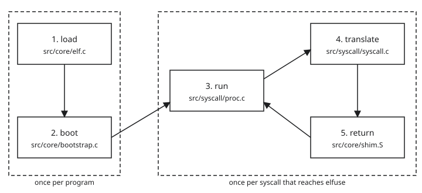

Part 3 of a series on [elfuse](https://github.com/sysprog21/elfuse).
[Part 2](../02-what-a-virtual-machine-is/) introduced the pieces: a virtual
machine with no kernel, the Linux program at EL0, the shim at EL1, and a thread
in the elfuse process that runs the vCPU. This part follows one run of
`build/elfuse build/test-hello` from start to exit and names the source file
behind each step. Later parts cover those steps one at a time.

All elfuse code and output below come from commit
[`73d8246b`](https://github.com/sysprog21/elfuse/tree/73d8246b), built on an
Apple M4 Mac.

## Five steps

`docs/internals.md` describes elfuse as
[five steps](https://github.com/sysprog21/elfuse/blob/73d8246b/docs/internals.md#lifecycle-in-five-steps):
load, boot, run, translate, and return. In the terms of parts 1 and 2:

1. Load: read the Linux program from disk, create the VM, copy the program
   into guest memory, and build its stack.
2. Boot: copy in the shim, write the page tables, and set up the vCPU's
   registers.
3. Run: let the vCPU execute the program on the processor until the next
   exit.
4. Translate: carry out the program's system call with macOS calls.
5. Return: put the result in the program's registers and resume it.

Load and boot happen once. Run, translate, and return repeat for every system
call that reaches elfuse, until the program exits.



## The call chain

`main()` in `src/main.c` parses the command line and hands off to
`elfuse_launch()` in `src/core/launch.c`. That function runs the whole
lifecycle in three calls
([src/core/launch.c](https://github.com/sysprog21/elfuse/blob/73d8246b/src/core/launch.c#L96-L212)):

```c
    if (guest_bootstrap_prepare(
            &g, args->elf_path, elf_host_temp, elf_guest_path, args->sysroot,
            args->guest_argc, args->guest_argv, envp_use, shim_bin,
            shim_bin_len, args->verbose, &guest_initialized, &boot) < 0)
...
    if (guest_bootstrap_create_vcpu(&g, &boot, args->verbose, &vcpu, &vexit) <
        0)
...
    int exit_code =
        vcpu_run_loop(vcpu, vexit, &g, args->verbose, args->timeout_sec, NULL);
```

`guest_bootstrap_prepare()` does the load step and most of the boot step.
`guest_bootstrap_create_vcpu()` finishes booting by creating the vCPU and
setting its registers. `vcpu_run_loop()` is the loop from part 2: it calls
`hv_vcpu_run()`, handles the exit, and repeats until the program exits. Its
return value becomes elfuse's own exit code.

## Timing load and boot

`ELFUSE_STARTUP_TRACE=steps` prints how long each part of load and boot took,
in the order each part finished:

```sh
$ ELFUSE_STARTUP_TRACE=steps build/elfuse build/test-hello
startup elf_load                        0.013 ms
startup hv_vm_create                    0.048 ms
startup primary_mmap                    0.872 ms
startup cow_shm_upgrade                 0.829 ms
startup hv_vm_map                       0.114 ms
startup guest_init                      1.955 ms
startup elf_map_segments                0.032 ms
startup load_interpreter                0.000 ms
startup shim_load_icache                0.010 ms
startup build_boot_regions              0.001 ms
startup guest_build_page_tables         0.015 ms
startup register_regions                0.024 ms
startup runtime_init                    0.588 ms
startup vdso_build                      0.004 ms
startup build_linux_stack               0.013 ms
startup hv_vcpu_create                  0.703 ms
startup hv_vcpu_configure               0.013 ms
hello
```

`guest_init` finishes after the four rows above it because it contains them,
so its time includes theirs. Read with the five steps in mind:

| Row | Step | What it does | Part |
|---|---|---|---|
| `elf_load` | load | read the ELF headers | 4 |
| `hv_vm_create` | load | ask Hypervisor.framework for a VM | 2 |
| `primary_mmap` | load | reserve the slab | 2 |
| `cow_shm_upgrade` | load | back the slab with a file, for later copies of the process | 11 |
| `hv_vm_map` | load | map the slab into the VM | 2 |
| `elf_map_segments` | load | copy the program into the slab | 4 |
| `load_interpreter` | load | load the dynamic linker; nothing to do for this program | 4 |
| `shim_load_icache` | boot | copy the shim into the slab | 5 |
| `build_boot_regions` | boot | list the memory regions and their permissions | 6 |
| `guest_build_page_tables` | boot | write the page tables | 6 |
| `register_regions` | boot | record the regions the program can see in `/proc/self/maps` | 6 |
| `runtime_init` | boot | set up elfuse's own syscall and process state | |
| `vdso_build` | boot | build a page of helper code the program can call | 10 |
| `build_linux_stack` | load | put the arguments and environment on the program's stack | 4 |
| `hv_vcpu_create` | boot | create the vCPU | 2 |
| `hv_vcpu_configure` | boot | set the vCPU's registers | 5 |

The steps with no rows, run, translate, and return, happen inside
`vcpu_run_loop()`.

## Reading the whole trace

`build/elfuse -v build/test-hello` prints 33 lines. Here they are in four
groups, with timestamps removed, the first four run-loop lines from part 2 left
out, and `L2[9]` to `L2[14]` replaced by `...`.

### Load

```text
DEBUG src/core/bootstrap.c:406: ELF entry=0x400000, 1 segments, load range [0x400000, 0x400026), machine=aarch64
INFO  src/core/guest.c:551: guest: primary slab 1024 GiB (40-bit) mapped
DEBUG src/core/bootstrap.c:425: IPA size: 40 bits (1024 GiB primary)
```

The program is one piece, a segment, of `0x26` bytes: 32 bytes for eight
instructions and 6 bytes for `hello\n`. It belongs at `0x400000`, and its first
instruction is also at `0x400000`. Part 4 covers how elfuse reads this from
the file. The slab and its size are from part 2.

### Boot

```text
DEBUG src/core/bootstrap.c:495: shim loaded at offset 0xfeffdf6000 (7508 bytes)
DEBUG src/core/bootstrap.c:574: TTBR0=0xfeff010000, IPA base=0x0
DEBUG src/core/bootstrap.c:185: L0[0]=0xfeff013003
DEBUG src/core/bootstrap.c:192: L1[0]=0xfeff014003
DEBUG src/core/bootstrap.c:199: L2[0]=0xfeff017003
DEBUG src/core/bootstrap.c:199: L2[2]=0xfeff018003
DEBUG src/core/bootstrap.c:199: L2[8]=0x60000001000765
...
DEBUG src/core/bootstrap.c:199: L2[15]=0x60000001e00765
DEBUG src/core/bootstrap.c:667: SP=0x7ffc430, entry=0x400000
DEBUG src/core/bootstrap.c:768: SCTLR_EL1 default=0x0
DEBUG src/core/bootstrap.c:787: vCPU configured: PC=0xfeffdf6000 SCTLR=0x34d0d984 VBAR=0xfeffdf6800 TTBR0=0xfeff010000 TCR=0x25b5903510
DEBUG src/core/bootstrap.c:790: ELR_EL1=0x400000 SP_EL0=0x7ffc430 SP_EL1=0xff00000000
DEBUG src/core/bootstrap.c:794: main thread registered with SP_EL1=0xff00000000
```

- The shim goes near the top of the slab, far above the addresses Linux
  programs expect to use (part 5).
- `TTBR0` is the system register that holds the address of the top page
  table. The `L0`, `L1`, and `L2` lines are the first entries of the tree from
  part 2; part 6 explains how to read them.
- `SP` is the stack pointer the program starts with. The stack is the memory
  where running functions keep their local variables and return addresses,
  and the stack pointer holds the address of its current end. Its exact value
  here depends on the size of the environment variables stored above it
  (part 4).
- The vCPU starts at `PC=0xfeffdf6000`, the shim. `VBAR` is the shim's table
  of exception handlers, `0x800` bytes in (part 5). `ELR_EL1` is where the
  shim's `eret` goes: `0x400000`, the program's first instruction. `SP_EL0` is
  the program's stack and `SP_EL1` is the shim's.
- `SCTLR` still has its lowest bit clear, so address translation is off until
  the shim asks for it.

### Run, translate, return

```text
...
DEBUG src/syscall/proc.c:4029: elfuse: HVC #5
DEBUG src/syscall/syscall.c:2807: syscall 64@0x400010(0x1, 0x400020, 0x6, 0x0, 0x0, 0x0)
hello
DEBUG src/syscall/syscall.c:2853:   -> 6 (0x6)
DEBUG src/syscall/proc.c:4567: elfuse: [2] vcpu_run PC=0xfeffdf7bf0
```

Part 2 walked through the three runs. The lines here are the translate step.
`syscall 64@...` is printed when elfuse starts handling the call and `-> 6`
when the handler returns. The third run resumes at `0xfeffdf7bf0`, the shim
instruction right after its `hvc #5`, which is where the return step happens:
the shim reads what elfuse left in the registers and goes back to the program.

### Exit

```text
DEBUG src/syscall/proc.c:4029: elfuse: HVC #5
DEBUG src/syscall/syscall.c:2807: syscall 93@0x40001c(0x0, 0x400020, 0x6, 0x0, 0x0, 0x0)
```

`exit` does not return, so no `->` line follows. elfuse ends the run loop and
exits with the program's status. The values after `0x0` are whatever the
program left in `x1` and `x2` from its earlier `write`; `exit` ignores them.

## Following `write` through the source

With `-v`, the translate step for syscall 64 passes through three places.
Without `-v`, `syscall_dispatch()` writes to the terminal itself, a fast path
part 7 describes.

1. The exit reaches the run loop in `src/syscall/proc.c`, which sees `hvc #5`
   and calls `syscall_dispatch()`
   ([proc.c](https://github.com/sysprog21/elfuse/blob/73d8246b/src/syscall/proc.c#L4032-L4034)).
2. `syscall_dispatch()` in `src/syscall/syscall.c` looks up `x8` in a dispatch
   table, an array indexed by syscall number that is generated from the list in
   `src/syscall/dispatch.tbl`, and calls the entry for `write`. Part 7 covers
   the table.
3. `sys_write()` in `src/syscall/io.c`, the handler that implements `write`,
   finds the macOS file descriptor behind the program's descriptor 1, checks
   that the six bytes at guest address `0x400020` are readable, and passes them
   to macOS
   ([io.c](https://github.com/sysprog21/elfuse/blob/73d8246b/src/syscall/io.c#L1520-L1596)).

The handler returns 6. `syscall_dispatch()` stores it in `x0`
([syscall.c](https://github.com/sysprog21/elfuse/blob/73d8246b/src/syscall/syscall.c#L2898))
and the next `hv_vcpu_run()` hands control back to the shim.

## Source layout

The source is in five directories, plus `src/main.c` for the command line and
four shared headers. The counts include every tracked file:

| Directory | Files | Lines | Holds | First file to read |
|---|---|---|---|---|
| `src/core/` | 22 | 15009 | loading, booting, guest memory, the shim | `bootstrap.c` |
| `src/syscall/` | 67 | 61117 | the syscall handlers | `syscall.c` |
| `src/runtime/` | 18 | 17584 | threads, futexes, `/proc`, copies of a process | `thread.c` |
| `src/debug/` | 12 | 3418 | crash reports, the GDB stub, logging | `crashreport.c` |
| `src/proved/` | 17 | 2288 | arithmetic with machine-checked proofs | `align.h` |

Most of the code is in `src/syscall/`. Parts 4 to 6 cover `src/core/`, parts 7
to 11 cover `src/syscall/` and `src/runtime/`, and parts 12 to 14 cover
debugging, x86_64 programs, and testing.

## What we learned

- elfuse runs a program in five steps: load and boot once, then run,
  translate, and return for each system call that reaches elfuse.
- `elfuse_launch()` runs the lifecycle in three calls: prepare, create the
  vCPU, and run the loop.
- `ELFUSE_STARTUP_TRACE=steps` times load and boot. `-v` prints the first
  page-table entries, the vCPU's first registers, every exit, and every syscall.
- A system call reaches its handler through a table generated from
  `dispatch.tbl`, and the result goes back in `x0`.

[Part 4](../04-loading-a-linux-program/) covers the load step: how elfuse reads
a Linux program from disk and prepares what the program expects to find when
its first instruction runs.
